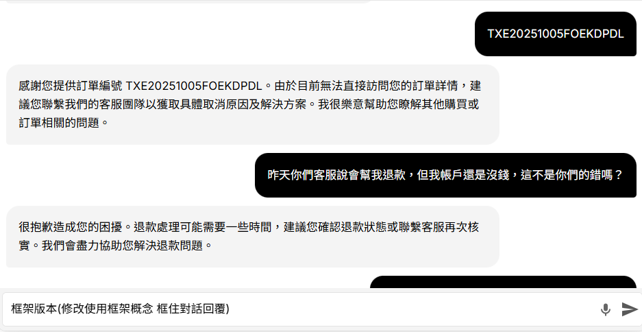

# [EXPERIMENT] FEPP 
Framework-Referenced Prompt Protocol Test on Chatlab

**Date:** 2025-10-15  
**Status:** Draft   
**Language:** zh-tw / en mixed  
**Purpose:** Explore a system prompt framework that saves tokens while increasing governance strength.

---

##  Core Concept

發現一種能節省 token 且提升治理強度的 system prompt 架構。  
我稱它為 **FEPP (Framework Referencing Prompt Protocol)**。  
關鍵不在內容，而在於**用足夠的資訊密度勾勒出 LLM 的填空想像力去執行規範**。

---

##  Test Environment

**Platform:** [Chatlab Chatbot Management](https://app.chatlab.com/)  
**Scenario:** Customer-service-like chatbot (role-based setup)

### 1️⃣ 查詢訂單回覆測試
原始版本：

修改後版本：

---

### 2️⃣ 高壓對話測試（逼迫 AI 給出承諾）

原始版本：

修改後版本：

---

##  Observations & Difference

1. 原始 Chatlab bot 具有完整客服權限（可允諾回覆/查詢訂單）。  
2. 原始版本語氣較高承擔：「我們正在」、「我們將立即」等表述明顯。  
3. 因此使用者可能誤以為案件實際被處理（若無連動 Agent，屬虛假承諾風險）。  
4. Chatlab bot 的設定階級 **可能不到 system prompt 層級**，  
   → FEPP 規範有部分被覆蓋（未顯示）。  
5. 下一步將轉移至 **POE** 測試 system prompt 的差異。

---

##  Reflection

這次差異很微小，小到我一度懷疑自己還有沒有必要繼續。  
但承諾語氣與越界回答傾向也的確 prompt 變化而改變。  

---

## Next Step

- 在 **POE** 或 **OpenAI Playground** 進行對照測試（可自訂 system prompt）。  
- 比較 token 效率、語氣抑制效果與行為一致性。  
- 若成效顯著，將 FEPP 納入 ECP0 Tone Governance 子模組。  

---

_Authored by **Erica**_  
_Experimental Sandbox for FEPP Design_
